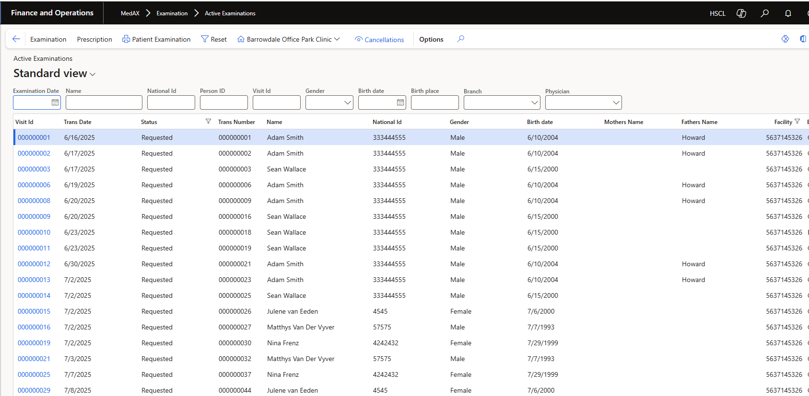
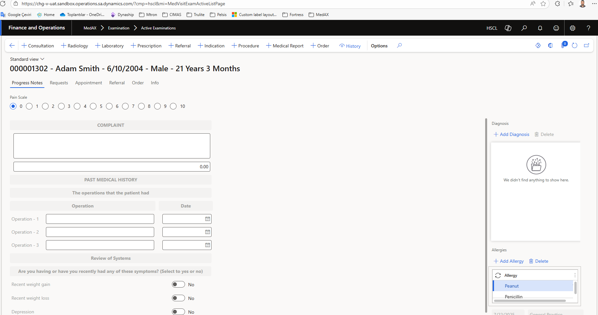

# Examination Module – Active Examinations

## Overview
The **Active Examinations** page allows physicians to manage patients who are currently undergoing a consultation. From here, the doctor can search for active visits, open a patient’s examination record, and record clinical details such as complaints, medical history, diagnoses, allergies, and progress notes. On this page date is today's day as a default. The doctor can change the date date and can find examination requests for the date. If the doctor deletes the date, he/she can see all the requests 

This page is the starting point for examining patients properly and ensuring their medical record is kept complete and up-to-date.

---

## Accessing Active Examinations
1. Navigate to:  
   **MedAX > Examination > Active Examinations**  
2. A list of all active patient examinations will be displayed.

---

## Page Layout

### 1. Active Examinations List
- **Filters available**:  
  - Examination Date  
  - Name / National ID / Person ID / Visit ID  
  - Gender, Birth date, Birth place  
  - Branch, Physician  
- **Columns displayed**:  
  - Visit ID, Transaction Date, Status  
  - Transaction Number, Patient Name  
  - National ID, Gender, Birth date  
  - Mother’s Name, Father’s Name  

👉 *Doctors can search or filter patients to quickly locate the correct examination.*

---

### 2. Patient Examination Record
Click on a **Visit ID** (blue link) to open the detailed examination page.

#### Key Tabs / Sections:
- **Progress Notes** – record patient’s complaint, review of systems, pain scale, and past medical history (operations, dates).  
- **Requests** – order laboratory, radiology, or other investigations.  
- **Appointment** – manage follow-up visits.  
- **Referral** – refer the patient to another specialty or physician.  
- **Order / Indication / Procedure** – record medical procedures, treatments, or prescriptions.  
- **Medical Report** – generate formal documentation (e.g. discharge notes, epicrisis).  
- **History** – view previous visits and medical background.  

---

## Recording an Examination (Example Workflow)

1. **Open the patient’s record** by selecting the Visit ID.  
2. **Enter patient complaints**
3. **Assess pain level** using the Pain Scale (0–10).  
4. **Add Past Medical History** – list any operations with dates.  
5. **Review of Systems** – mark symptoms such as recent weight change, depression, etc.  
6. **Add Diagnoses** – click **+ Add Diagnosis**, choose from the medical code list.  
7. **Record Allergies** – click **+ Add Allergy**, select allergy type (e.g. Peanut, Penicillin).  
8. **Save progress** – ensure all notes are updated before navigating away.  

---

## Best Practices
- Always verify patient identity using **Name, National ID, and Visit ID** before starting.  
- Record **complaints in patient’s own words** whenever possible.  
- Update **allergies and past medical history** at every visit.  
- Use **diagnosis codes** consistently for reporting and billing purposes.  
- Document **pain scale** at each encounter for continuity of care.  

---
# Issuing Sick Notes (Medical Report)

## 1. Purpose  
This document describes the steps to generate and issue a Sick Note (Medical Report) for patients in MedAX.  

## 2. Definition  
A **Sick Note (Medical Report)** is an official document provided by a physician to confirm a patient’s illness and recommend rest or exemption from work/school for a specific period.  

## 3. Access Path  
1. Go to **Front Office > Visit List**.  
2. Select the patient visit for which a sick note is required.  
3. Open the visit details and choose **Medical Report > Sick Note**.  

## 4. Data Entry  
When creating a Sick Note, fill in the following information:  
- **Patient Name** (auto-filled from visit record)  
- **Date of Visit** (auto-filled)  
- **Diagnosis / Reason for Sick Note**  
- **Start Date** of rest period  
- **End Date** of rest period  
- **Physician Name** (auto-filled)  
- **Additional Notes** (optional, e.g., “Fit to resume work on …”)  

After entering the required information, click **Generate Report**.  

## 5. Output  
- The system generates a formal Sick Note in PDF or printable format.  
- The document includes patient and physician details, rest period, and diagnosis.  
- The Sick Note is linked to the patient’s medical record for future reference.  

## 6. Example Scenario  
1. Patient: *Nina Frenz*  
2. Visit: `000000049` (Outpatient – General Practice)  
3. Reason: Influenza  
4. Sick Note: 3 days (16/07/2025 – 18/07/2025)  
5. Physician: *Dr. Steve Karagedik*  
6. Output: Printable Sick Note PDF stored in patient’s record.  

## 7. Tips  
- Ensure the **rest period** is compliant with organizational or legal policies.  
- For long-term absence, an extended medical certificate may be required.  
- Once issued, Sick Notes cannot be modified — if correction is needed, a new note must be generated.

# Creating a Referral in MedAX (For Doctors)

This guide explains how to create a **patient referral** within the **MedAX healthcare management system**, specifically for referring patients to services such as **Radiology**, **Laboratory**, or other internal facilities within the CIMAS Healthcare network.

---

## 🩺 Overview

The **Referral** feature in MedAX allows doctors to refer patients for additional medical services or consultations within the CIMAS system.  
Referrals can be **internal** (within the same facility) or **external** (to another branch or specialist).

---

## 📋 Steps to Create a Referral

### 1. Open the Patient Record
1. From the **Examination** or **Active Examinations** module, search for and open the patient’s record.  
2. Confirm that the patient information (name, ID, age, gender) is correct at the top of the screen.

---

### 2. Access the Referral Tab
1. In the patient’s examination view, select the **Referral** tab from the top navigation bar.  
2. You’ll see any existing referrals listed under this section.

---

### 3. Add a New Referral
1. Click **➕ Referral** in the toolbar at the top.  
2. A new referral form will appear.

---

### 4. Fill in the Referral Details
Complete the following fields:

| Field | Description |
|-------|--------------|
| **Referral Number** | Automatically generated by the system. |
| **Referral Date** | Defaults to the current date but can be edited if needed. |
| **Referral Type** | Choose **Internal** (for CIMAS network referrals) or **External** (for non-CIMAS facilities). |
| **Performing Branch** | Select the branch that will handle the referred service (e.g. *Radiology*). |
| **Performing Facility** | Choose the physical location (e.g. *Borrowdale Office Park*). |
| **Performing Physician** | If applicable, choose the doctor or specialist who will perform the procedure or review. |
| **Performing Visit** | Optional – link to a specific visit if required. |

---

### 5. Add Additional Information (Optional)
On the **right-hand panel**, you can enter supplementary details under:
- **Details**
- **Info 1**
- **Info 2**
- **Info 3**

These fields can be used to provide clinical notes, special instructions, or diagnostic justifications for the referral.

---

### 6. Save the Referral
- Click **Save** or **Detail** to confirm the referral entry.  
- The new referral will now appear in the **Referral List** with its unique referral number and date.

---

## 🔍 Viewing and Managing Referrals

| Action | Description |
|--------|--------------|
| **Detail** | Opens the referral form for review or editing. |
| **Cancel** | Cancels an active referral (status updated accordingly). |
| **History** | Shows the referral history and related documents. |

---

## 🧠 Example

In the example below, the doctor referred *Adam Smith* (21 years old) to **Radiology** at **Borrowdale Office Park**, performed by **Dr. Hennie van den Berg**.  
- Referral Type: *Internal*  
- Referral Number: *000000026*  
- Referral Date: *17.10.2025*

---

## 💡 Tips
- Always ensure you select the correct **performing facility** before saving.  
- If the referral is urgent, note this in **Info 1** or **Details**.  
- The referral record is automatically linked to the patient’s file and visible to the receiving facility.  

---

## ⚙️ Troubleshooting
- **Referral button disabled?** Ensure an active examination session is open.  
- **Facility not appearing?** Check if the facility is registered under the same branch.  
- **Error on save?** Verify required fields (Referral Type, Performing Facility) are filled.

---

## 📞 Support
For any technical assistance or access issues, contact the **MedAX Support Team** at:  
📧 *support@medax365.com*  
🌐 [https://docs.medax365.com/support](https://docs.medax365.com/support)

