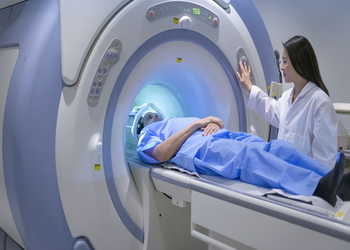

## MedAX USERs

|  |  |  |
|:------------------:|:-------------------:|:------------------:|
|   **Physician**    |  **Receptionist**   |  **Nursing Desk**  |
|    A licensed medical doctor registered in the system, authorized to diagnose, treat, prescribe, and document patient care with role-specific permissions and responsibilities.    |     A staff role responsible for patient registration, scheduling, and front-desk administrative tasks, with permissions limited to non-clinical workflows.    |    A centralized digital workspace for nurses to manage patient care tasks, documentation, and coordination within the hospital system.     |
|        [Active Examinations](https://docs.medax365.com/examination/active-examinations/)        |        Link         |        Link        |
|        [Visit List](https://docs.medax365.com/front-office/visit-list/)        |        Link         |        Link        |

|  |  |  |
|:----------------:|:-----------------:|:------------:|
|  **Radiology**   |  **Laboratory**   |  **Admin**   |
|   The system module and role for managing diagnostic imaging orders, procedures, and reports, integrated with patient records and clinical workflows    |    The module and role for managing diagnostic test orders, specimen processing, and results reporting within the hospital system.    | A role responsible for managing system setup, user access, security, and maintenance, with full technical permissions but no clinical functions.  |
|       Link       |       Link        |     Link     |
|       Link       |       Link        |     Link     |

## MedAX SETUP

### Top Resources for healthcare processes

Link1
Link2
Link3

### Understanding basic concepts

Link1
Link2
Link3
