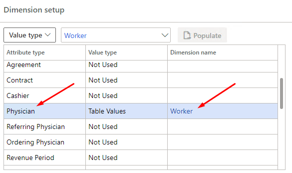
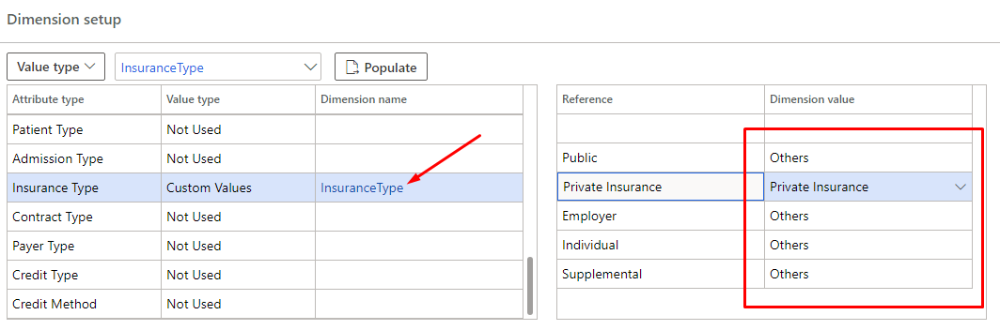

## Overview

A company is a type of legal entity. A legal entity is an organization that has a registered or legislated legal structure. Legal entities can enter into legal contracts and are required to prepare statements that report on their performance. 

 Currently, companies are the only kind of legal entity that you can create, and every legal entity is associated with a company ID. This association exists because some functional areas in the program use a company ID, or DataAreaId, in their data models. In these functional areas, companies are used as a boundary for data security. Users can access data only for the company that they are currently logged on to.

### Company

The companies that need to be created in this section must be healthcare providers that use MedAX. To create a new company, click on 'New' button and you can select your company that has been previously created in Organization Administration-Organizations-Legal Entity. So, the fields of name, country and language are populated automatically.

### Defaults

#### Patient
In this section, you can set a default customer for the company you have selected. Once you provide any service, your customer will be the customer you specify here. One of the previously created customers is selected in the **Accounts Receivable-All customers** section. In order for the transactions in MedAX to be carried out effectively, the customer created as 'Patient Account' must be selected. You can also modify the patient account in the **Accounts Receivable-All customers** section. 

#### Tax

It is necessary to include a customer in a tax group, when the customer is created in the system. For example, some customers may be exempt from tax. Besides, tax groups depending on the product must be created. One of them is value added tax. Value added tax rates are set by the government and may vary depending on the type of product. While making tax calculations, the tax group of the customer and the tax group to which the product is included are taken into account. Customer tax groups have been determined for tax calculations in MedAX. In the Default section, the customer tax group can be set as default in the tax section.

#### Examination

In this section, you can set the default type of examination to be initiated for each health service.

### Dimension Setup

Financial dimensions are created for that you can use as account segments for charts of accounts. There are two types of financial dimensions: custom dimensions and entity-backed dimensions. Custom dimensions are shared across legal entities, and the values are entered and maintained by users. For entity-backed dimensions, the values are defined somewhere else in the system, such as in Customers or Stores entities. Some entity-backed dimensions are shared across legal entities, whereas other entity-backed dimensions are company-specific.

#### Entity-backed Dimension (Table Values)

The Dimension setup is required to create efficient analysis with ledger accounts. You can determine the reasons that affect the revenue or expense sources with the adjustments you make in this section. Dimension setup is done as follows; First you need to determine the attribute type, then you must select the financial dimension type mentioned above in value type column. If value type is selected as table values, you must select the predefined dimension name that is compatible with the attribute type. For example; If attribute type is selected as physician, if value type is selected as table values, dimension name should be selected as worker in accordance with attribute type. In this case, while the invoice is posted to the general legder, the physician information of that invoice is also posted to the revenue account. In other words, you add a doctor-based dimension to the revenue account, and in this way, you can understand the contribution of each doctor to the revenue. This causes you to open a lower breakdown for the revenue account. At the same time, physician-based costs can also be calculated in this way. Thus, doctor performance reports can be prepared. Consequently, thanks to the dimension setup, it is possible to classify financial transactions, examine account balances and generate reports on the basis of those classes.

#### Custom Dimension (Custom Values)

You may want to create a custom dimension from the financial dimension types mentioned above. In this case, you need to create a new financial dimension and create new values in this dimension in **General Ledger-Chart of Accounts-Dimensions-Financial Dimensions** section. Because when you choose custom value in dimension setup, you can assign those dimension values to the references of the attribute type you choose. In this way, you can make financial analyzes with lower breakdowns. For example, there is a financial dimension as InsuranceType. Within this dimension, two values have been created as private insurance and others. Since accounting department demands to follow the insurance type in these two sub-sections, you choose insurance type as attribute type in the dimension setup, choose value type as custom value and select InsuranceType as dimension type. After clicking the populate button, public, private insurance, employer, individual, and supplemental references for insurance type are automatically displayed. For each of these, you can choose one of the dimension values as mentioned. In this way, the accounting department will be able to follow up all insurance types as private insurance or others.

### Inventory Posting

### Journals

The inventory journals in Supply Chain Management are used to post physical inventory transactions of various types, such as the posting of issues and receipts, inventory movements, the creation of bills of materials (BOMs), and the reconciliation of physical inventory. All these inventory journals are used in a similar way, but they are divided into different types. One of the types is movement. 

A movement journal is an inventory journal that you can use to add or remove inventory. It works like an inventory adjustment journal. However, one key difference is that the main account that offsets the entry is specified.

The movement journal enters beginning balances and one-off adjustments that must be expensed. For example, it's used when inventory is removed for a sales sample.

When the journal is posted, the physical and financial updates occur simultaneously.

Positive quantities on the journal lines represent receipts, and negative quantities represent issues.

In MedAX, you can assign the predefined movements to the drug and supply fields. The movements can be created in **Inventory Management-Setup-Journal Names-Inventory** section.

### Journal Events

### Cost

